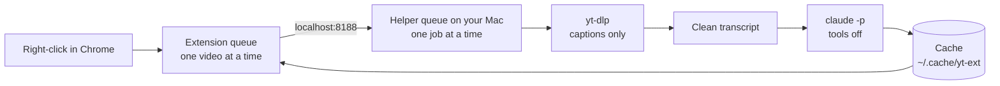

# yt-summarize

**Summarize a YouTube video, then ask questions about it.**

Beta for macOS and Chrome. Captions and Claude can take seconds to several minutes;
optional local audio transcription takes longer. Cached summaries open immediately.

A Chrome extension plus a small helper that runs on your own Mac. It reads the video's captions
and asks Claude for a tight summary: a TL;DR, 3 to 5 one-sentence bullets, and a bottom line.

```
Some Talk Title | Some Channel | 42:10

TL;DR: The claim the video makes, in one or two sentences.

- Core claim: One sentence.
- The evidence: One sentence.
- What to do: One sentence.

Bottom line: The takeaway, if the video has one.
```

- **No API keys.** It uses your own Claude plan through the `claude` command.
- **Your own helper.** The queue and summary cache live on your Mac. **Transcripts, video
  metadata, and chat questions are sent to Claude for processing** using your account and quota.
- **Light.** It normally downloads captions only; optional transcription downloads audio
  temporarily. Python standard library, plain
  JavaScript, no `pip install`, no `npm install`.

## How it works



## What you need

- A Mac with Chrome
- A paid Claude plan (Pro or Max)
- Terminal access; allow extra time if Homebrew and Claude Code are new to you

## Set it up

**1. Get the code.** Press the green **Code** button on GitHub, then **Download ZIP**. Unzip it.
Open the Terminal app, type `cd ` (with the space), drag the unzipped folder into the window, and
press return.

**2. Check your Mac.**

```
./install.sh
```

It installs no software. It lists missing requirements, checks optional transcription tools and
the model file, then makes one small Claude request with the same model used by the helper
(60-second timeout). This uses your Claude quota. Run it again until it says **All set**.

**3. Try one video first.**

```
./run.sh
```

Leave that window open, visit <http://localhost:8188/>, and paste a YouTube video link.
Wait for its summary. You can use this page without installing the extension.
Press Ctrl-C in Terminal to stop the helper.

**4. Add the Chrome shortcut.**

1. Open `chrome://extensions`.
2. Turn on **Developer mode** (top right).
3. Press **Load unpacked** and pick the `extension` folder inside this folder.
4. Reload any YouTube tabs that were already open, then right-click a video.

The extension's bundled public key keeps its ID stable; no key or pairing code needs copying.
If you installed an earlier beta without that key, remove that extension before loading this one.

## Use it

| Where you are | What you do | What happens |
| --- | --- | --- |
| On a video | Right-click → **Summarize this video** | The video joins the queue, and the panel opens on its row |
| Any YouTube link, any page | Right-click → **Summarize this video link** | Same, without opening the video |
| Hovering a video on YouTube | Press **⌥S** | Summarize it. **⌥C** opens a chat about it |
| Anywhere on YouTube | Click the toolbar button | Show or hide the panel: queue, progress, summaries |
| On a video | Right-click → **Chat about this video** | Open the chat page; click **Summarize this video** if it is not cached yet |

The panel never opens on its own. Once you close it in a tab, it stays closed there.

**The bucket page** at <http://localhost:8188/> is the full view:

- Paste or drop YouTube links to queue them.
- Read every summary you ever made, and delete the ones you do not want.
- Chat about a video in the page.
- Copy a full transcript.
- Edit the summary prompt (the ⚙ button). "Reset to default" restores the original.

## When it fails

| You see | Cause | Fix |
| --- | --- | --- |
| "helper not running" | `./run.sh` is not running | Start it again and leave the window open |
| "HTTP Error 429" | YouTube rate-limits caption downloads | Wait a few hours. Do not retry in a loop; retries make it last longer |
| "no captions" | The video has no caption track | Nothing to fix. With `whisper-cli`, `ffmpeg`, and a Whisper model installed, the helper transcribes the audio on your Mac and shows a progress bar |
| A sudden failure on every video | YouTube changed something | `brew upgrade yt-dlp` |
| "claude failed" | Claude is logged out or out of quota | Run `claude` once and check |

## Settings

Set these before `./run.sh`, for example `YT_EXT_MODEL=opus ./run.sh`.

| Variable | Default | Meaning |
| --- | --- | --- |
| `YT_EXT_MODEL` | `sonnet` | The Claude model that writes the summary |
| `YT_EXT_PORT` | `8188` | The helper's port. The extension expects 8188 |
| `YT_EXT_CACHE` | `~/.cache/yt-ext` | The folder that holds your summaries |
| `YT_WHISPER_MODEL` | first `*.bin` in `~/.cache/yt-ext/models/` | The whisper model for videos with no captions |

## Optional audio transcription

Install the tools with `brew install whisper-cpp ffmpeg`. Obtain a compatible ggml Whisper
model using the [whisper.cpp model instructions](https://github.com/ggml-org/whisper.cpp/tree/master/models),
then put its `.bin` file in `~/.cache/yt-ext/models/` or set `YT_WHISPER_MODEL` to its path.
Run `./install.sh` again to check it. The default limit is one hour of video; change
`YT_WHISPER_MAX_SECONDS` before starting the helper if needed. Audio files are temporary.

## Restart, update, or remove

- **Restart:** open Terminal in this folder and run `./run.sh` again. Finished summaries remain cached.
  If port 8188 is occupied by an earlier helper, stop that helper with Ctrl-C first.
- **Update:** stop the helper, replace this folder with the new release, run `./install.sh`,
  then `./run.sh`. In `chrome://extensions`, press **Reload** on YT Summarize and reload YouTube tabs.
  Keep the folder at the same path. Cached summaries stay outside the code folder.
- **Remove:** stop the helper, remove YT Summarize from `chrome://extensions`, then delete this
  code folder. To erase saved summaries, transcripts, and chat briefings too, delete
  `~/.cache/yt-ext` (or your `YT_EXT_CACHE` folder). This permanently removes that archive.

The server serializes expensive work across tabs and the extension, and combines duplicate
in-flight summary requests. Browsers poll for results, so long transcription jobs can finish.
Pending server jobs are held in memory: after a helper restart, retry unfinished videos.

## Security and privacy

- The helper listens on `127.0.0.1` and validates Host and Origin headers. It allows its own
  page and the exact bundled Chrome extension origin, rather than trusting every extension.
  Other browser installations must be explicitly configured with `YT_EXT_ALLOWED_ORIGINS`
  (comma-separated full origins). Safari gives an extension a new random origin at every
  launch, so a Safari build needs `YT_EXT_ALLOW_SAFARI=1`, which admits every Safari extension
  on the Mac; it is off by default. This is a browser-request defense, not authentication
  against programs already running on your Mac or powerful extensions that can modify pages.
- Links from other sites do not automatically summarize a new video. The chat page requires
  a click, transcript GETs only read cached text, and the helper page cannot be framed.
- Summary and in-page chat calls disable Claude tools and MCP configuration, skip user/project
  settings, disable ordinary hooks, and run in an empty temporary directory. Claude session
  persistence is disabled for these calls. Organization-managed policies can still apply.
  Untrusted transcripts can still produce misleading summaries or answers.
- Claude processes the supplied text remotely. Your Claude account's privacy settings and
  service policies apply. The app's cache remains on your Mac until you delete it.

**Open in terminal** is optional and requires [iTerm2](https://iterm2.com). It starts a normal
interactive Claude session with your normal tools and permissions; it does not use the
restricted summary runner. Only approve actions you intended to request.

The automated checks exercise these boundaries and job handling; they are not a security audit
or a guarantee about every browser, CLI version, or system configuration.

## Layout

```
extension/     the Chrome extension (Manifest V3)
  background.js  queues requests and polls the helper
  content.js     the on-page panel and the keyboard shortcuts
  shared.js      what a YouTube URL is; how a summary is drawn
helper/        the local server
  server.py      routes, shared job queue, cache, prompt, access checks
  captions.py    yt-dlp captions -> clean text
  transcribe.py  optional local whisper fallback
  claude_text.py the one place claude runs (tools off)
  index.html     the bucket page
run.sh         starts the helper
install.sh     checks your Mac
```

## Development checks

```
python3 helper/test_captions.py
python3 helper/test_fallback.py
python3 helper/test_security.py
python3 helper/test_runtime.py
node helper/test_frontend.js
```

Node is only needed for the frontend development tests, not for setup or use.

## Licence

MIT. No warranty. This project is not affiliated with YouTube or Anthropic.
