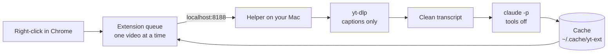

# yt-summarize

**Right-click a YouTube video. Read the summary 10 seconds later.**

A Chrome extension plus a small helper that runs on your own Mac. It reads the video's captions
and asks Claude for a tight summary: a TL;DR, 3 to 5 one-sentence bullets, and a bottom line.

```
Some Talk Title | Some Channel | 42:10

TL;DR: The claim the video makes, in one or two sentences.

- Core claim: One sentence.
- The evidence: One sentence.
- What to do: One sentence.

Bottom line: The takeaway, if the video has one.
```

- **No API keys.** It uses your own Claude plan through the `claude` command.
- **Local.** The helper, the queue, and every summary live on your Mac.
- **Light.** It downloads captions only, never the video. Python standard library, plain
  JavaScript, no `pip install`, no `npm install`.

## How it works



## What you need

- A Mac with Chrome
- A paid Claude plan (Pro or Max)
- About 15 minutes

## Set it up

**1. Get the code.** Press the green **Code** button on GitHub, then **Download ZIP**. Unzip it.
Open the Terminal app, type `cd ` (with the space), drag the unzipped folder into the window, and
press return.

**2. Check your Mac.**

```
./install.sh
```

It installs nothing and changes nothing. It lists what is missing and prints the one command that
fixes each item. Run it again until it says **All set**.

**3. Load the extension in Chrome.**

1. Open `chrome://extensions`.
2. Turn on **Developer mode** (top right).
3. Press **Load unpacked** and pick the `extension` folder inside this folder.

**4. Start the helper.**

```
./run.sh
```

Leave that window open. Press Ctrl-C to stop it.

## Use it

| Where you are | What you do | What happens |
| --- | --- | --- |
| On a video | Right-click → **Summarize this video** | The video joins the queue, and the panel opens on its row |
| Any YouTube link, any page | Right-click → **Summarize this video link** | Same, without opening the video |
| Hovering a video on YouTube | Press **⌥S** | Summarize it. **⌥C** opens a chat about it |
| Anywhere on YouTube | Click the toolbar button | Show or hide the panel: queue, progress, summaries |
| On a video | Right-click → **Chat about this video** | Ask questions against the summary and the full transcript |

The panel never opens on its own. Once you close it in a tab, it stays closed there.

**The bucket page** at <http://localhost:8188/> is the full view:

- Paste or drop YouTube links to queue them.
- Read every summary you ever made, and delete the ones you do not want.
- Chat about a video in the page.
- Copy a full transcript.
- Edit the summary prompt (the ⚙ button). "Reset to default" restores the original.

## When it fails

| You see | Cause | Fix |
| --- | --- | --- |
| "helper not running" | `./run.sh` is not running | Start it again and leave the window open |
| "HTTP Error 429" | YouTube rate-limits caption downloads | Wait a few hours. Do not retry in a loop; retries make it last longer |
| "no captions" | The video has no caption track | Nothing to fix. With `whisper-cli` and `ffmpeg` installed, the helper transcribes the audio on your Mac and shows a progress bar |
| A sudden failure on every video | YouTube changed something | `brew upgrade yt-dlp` |
| "claude failed" | Claude is logged out or out of quota | Run `claude` once and check |

## Settings

Set these before `./run.sh`, for example `YT_EXT_MODEL=claude-opus-5 ./run.sh`.

| Variable | Default | Meaning |
| --- | --- | --- |
| `YT_EXT_MODEL` | `claude-sonnet-5` | The Claude model that writes the summary |
| `YT_EXT_PORT` | `8188` | The helper's port. The extension expects 8188 |
| `YT_EXT_CACHE` | `~/.cache/yt-ext` | The folder that holds your summaries |
| `YT_WHISPER_MODEL` | first `*.bin` in `~/.cache/yt-ext/models/` | The whisper model for videos with no captions |

## How it stays safe

The helper is a small web server, and Claude reads text from strangers' videos. Two locks cover
that:

1. **Only your own pages reach the helper.** It listens on `127.0.0.1` only. It refuses every
   request that does not come from the extension or from its own page, so a web site you visit
   gets a 403.
2. **Claude has no tools.** Every call runs as `claude -p --tools ""`. Claude cannot run commands,
   read files, or use the network. The worst a hostile transcript can do is a bad summary.

`python3 helper/test_security.py` proves both locks (31 checks, against a real server).

One exception to know: the **Open in terminal** button starts a normal interactive `claude` on the
transcript, in iTerm2. That session has Claude's normal tools and normal permission prompts. Do
not approve a command there that you did not ask for.

## Layout

```
extension/     the Chrome extension (Manifest V3)
  background.js  owns the queue; one summary at a time
  content.js     the on-page panel and the keyboard shortcuts
  shared.js      what a YouTube URL is; how a summary is drawn
helper/        the local server
  server.py      routes, cache, prompt, the two locks
  captions.py    yt-dlp captions -> clean text
  transcribe.py  optional local whisper fallback
  claude_text.py the one place claude runs (tools off)
  index.html     the bucket page
run.sh         starts the helper
install.sh     checks your Mac
```

Tests: `python3 helper/test_captions.py`, `helper/test_fallback.py`, `helper/test_security.py`.

## Licence

MIT. No warranty. This project is not affiliated with YouTube or Anthropic.
