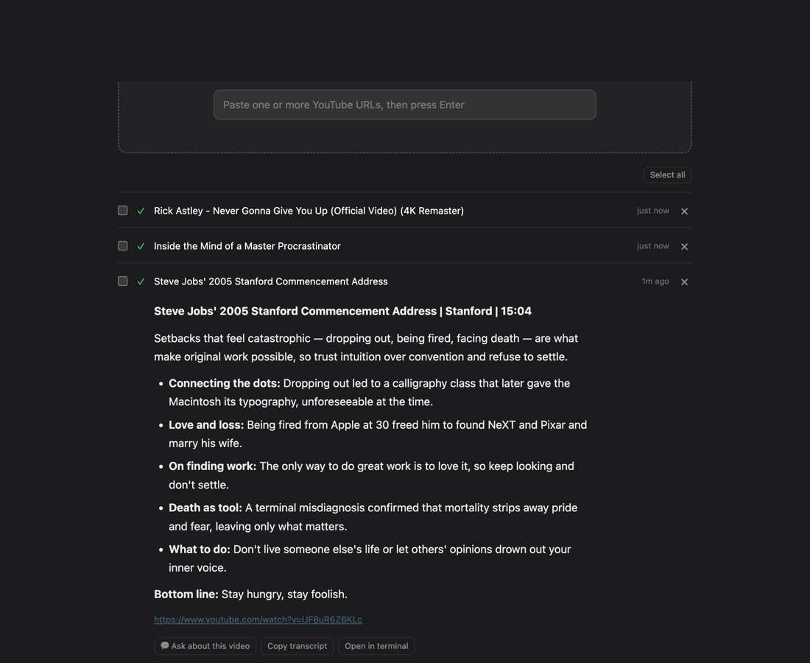
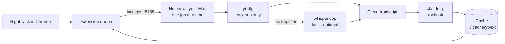

<div align="center">

# ▶︎ yt-summarize

**Right-click any YouTube video. Get the point in 30 seconds. Then ask it questions.**




</div>

A Chrome extension and a tiny helper on your own Mac. It reads a video's captions and has
Claude write a tight summary: a TL;DR, 3 to 5 labelled one-sentence bullets, and a bottom
line. It runs on **your existing Claude plan** through the `claude` command. No API key, no
server to host, no account to make.

- **Queue as you browse.** Right-click videos or links; they summarize one at a time in the background.
- **Go deeper.** Chat with any video. Answers come from its full transcript.
- **Keep everything.** Every summary lands in a local archive you can reread and prune.
- **No captions? Still works.** With `whisper-cpp` installed, it transcribes the audio on your Mac.
- **Tiny.** Python standard library and plain JavaScript. Nothing to `pip install` or `npm install`.

> **Beta** for macOS + Chrome. A captioned video takes seconds; local transcription takes
> longer. Cached summaries open instantly.

## Quick start

You need a Mac, Chrome, and a paid Claude plan (Pro or Max) with
[Claude Code](https://docs.claude.com/en/docs/claude-code) logged in.

**1. Get the code.** Press the green **Code** button → **Download ZIP**, and unzip it. In
Terminal, type `cd ` (with the space), drag the folder into the window, and press return.

**2. Check your Mac, then start the helper.**

```sh
./install.sh     # lists anything missing; installs nothing; makes one small Claude call
./run.sh         # starts the helper; leave this window open (Ctrl-C stops it)
```

Run `./install.sh` again until it says **All set**.

**3. Try it.** Open <http://localhost:8188/>, paste a YouTube link, press Enter. This page
works without the extension.

**4. Add the right-click.** Open `chrome://extensions`, turn on **Developer mode**, press
**Load unpacked**, and pick the `extension` folder. Reload any YouTube tabs that were open.

## Use it

| Where you are | What you do | What happens |
| --- | --- | --- |
| On a video | Right-click → **Summarize this video** | It joins the queue; the panel opens on its row |
| Any YouTube link, any page | Right-click → **Summarize this video link** | Same, without opening the video |
| Hovering a video on YouTube | **⌥S** | Summarize it. **⌥C** opens a chat about it |
| Anywhere on YouTube | Click the toolbar button | Show or hide the panel: queue, progress, summaries |
| On a video | Right-click → **Chat about this video** | Open the chat page on that video |

The panel never opens on its own. Once you close it in a tab, it stays closed there.

**The bucket page** at <http://localhost:8188/> is the full view: paste or drop links to queue
them, reread every summary you ever made, chat about a video, copy a full transcript, and edit
the summary prompt (the ⚙ button; "Reset to default" restores the original).

## How it works


```mermaid
flowchart LR
    A[Right-click in Chrome] --> B[Extension queue]
    B -->|localhost:8188| C[Helper on your Mac<br/>one job at a time]
    C --> D[yt-dlp<br/>captions only]
    D -. no captions .-> W[whisper.cpp<br/>local, optional]
    D --> E[Clean transcript]
    W --> E
    E --> F[claude -p<br/>tools off]
    F --> G[(Cache<br/>~/.cache/yt-ext)]
    G --> B
```

The queue and the archive live on your Mac. **Transcripts, video metadata, and chat questions
go to Claude for processing**, on your account and quota.

## When it fails

| You see | Cause | Fix |
| --- | --- | --- |
| "helper not running" | `./run.sh` is not running | Start it again and leave the window open |
| "HTTP Error 429" | YouTube rate-limits anonymous caption downloads | Wait a few hours, or set `YT_COOKIES_FROM_BROWSER` (below). Do not retry in a loop |
| "no captions" | The video has no caption track | Install the optional transcription tools (below) |
| Every video fails at once | YouTube changed something | `brew upgrade yt-dlp` |
| "claude failed" | Claude is logged out or out of quota | Run `claude` once and check |

<details>
<summary><b>Settings</b></summary>

Set these before `./run.sh`, for example `YT_EXT_MODEL=opus ./run.sh`.

| Variable | Default | Meaning |
| --- | --- | --- |
| `YT_EXT_MODEL` | `sonnet` | The Claude model that writes the summary |
| `YT_EXT_PORT` | `8188` | The helper's port. The extension expects 8188 |
| `YT_EXT_CACHE` | `~/.cache/yt-ext` | The folder that holds your summaries |
| `YT_COOKIES_FROM_BROWSER` | off | A browser name (e.g. `chrome`, `safari`). yt-dlp then fetches captions as your logged-in YouTube session, which gets past most 429s. The cookies go only to YouTube |
| `YT_WHISPER_MODEL` | first `*.bin` in `~/.cache/yt-ext/models/` | The Whisper model for videos with no captions |
| `YT_WHISPER_MAX_SECONDS` | `3600` | The longest video it will transcribe locally |

</details>

<details>
<summary><b>Optional: local transcription for videos with no captions</b></summary>

Install the tools with `brew install whisper-cpp ffmpeg`. Get a ggml Whisper model using the
[whisper.cpp model instructions](https://github.com/ggml-org/whisper.cpp/tree/master/models),
then put its `.bin` file in `~/.cache/yt-ext/models/` or set `YT_WHISPER_MODEL` to its path.
Run `./install.sh` again to check it.

It fires only when YouTube says the video has no captions, never on a rate limit or a timeout.
The row shows a progress bar while it works. Audio files are temporary; only the text is kept.

</details>

<details>
<summary><b>Restart, update, or remove</b></summary>

- **Restart:** run `./run.sh` again in this folder. Finished summaries stay cached. If port 8188
  is taken by an earlier helper, stop that one with Ctrl-C first.
- **Update:** stop the helper, replace this folder with the new release, run `./install.sh`,
  then `./run.sh`. In `chrome://extensions`, press **Reload** on YT Summarize and reload YouTube
  tabs. Keep the folder at the same path. Cached summaries live outside the code folder.
- **Remove:** stop the helper, remove YT Summarize from `chrome://extensions`, and delete this
  folder. To erase saved summaries, transcripts, and chat briefings too, delete
  `~/.cache/yt-ext` (or your `YT_EXT_CACHE` folder). That cannot be undone.

The helper runs expensive work one job at a time across tabs and the extension, and merges
duplicate requests. Browsers poll for results, so long jobs can finish. Pending jobs live in
memory: after a helper restart, retry unfinished videos.

</details>

<details>
<summary><b>Security and privacy</b></summary>

- The helper listens on `127.0.0.1` and checks Host and Origin headers. It admits its own page
  and the exact bundled Chrome extension origin, not every extension. Other browser installs
  need `YT_EXT_ALLOWED_ORIGINS` (comma-separated full origins). Safari gives an extension a new
  random origin at every launch, so a Safari build needs `YT_EXT_ALLOW_SAFARI=1`, which admits
  every Safari extension on the Mac; it is off by default. This defends against web pages, not
  against programs already running on your Mac or extensions that can modify pages.
- Links from other sites cannot start a summary. The chat page needs a click, transcript GETs
  only read cached text, and the helper page cannot be framed.
- Summary and chat calls turn off Claude tools and MCP configuration, skip user/project
  settings, turn off ordinary hooks, and run in an empty temporary directory with session
  persistence off. Organization-managed policies can still apply. An untrusted transcript can
  still produce a misleading summary or answer.
- Claude processes the text remotely; your Claude account's privacy settings apply. The cache
  stays on your Mac until you delete it.

**Open in terminal** is optional and needs [iTerm2](https://iterm2.com). It starts a normal
interactive Claude session with your normal tools and permissions, not the restricted runner.
Only approve actions you meant to request.

The automated checks cover these boundaries and the job handling. They are not a security
audit or a guarantee for every browser, CLI version, or system setup.

</details>

<details>
<summary><b>Layout and development checks</b></summary>

```
extension/       the Chrome extension (Manifest V3)
  background.js    queues requests and polls the helper
  content.js       the on-page panel and the keyboard shortcuts
  shared.js        what a YouTube URL is; how a summary is drawn
helper/          the local server
  server.py        routes, job queue, cache, prompt, access checks
  captions.py      yt-dlp captions -> clean text
  transcribe.py    optional local whisper fallback
  claude_text.py   the one place claude runs (tools off)
  index.html       the bucket page
run.sh           starts the helper
install.sh       checks your Mac
```

```sh
python3 helper/test_captions.py
python3 helper/test_fallback.py
python3 helper/test_security.py
python3 helper/test_runtime.py
node helper/test_frontend.js     # Node is only needed for this test
```

</details>

## License

MIT. No warranty. Not affiliated with YouTube or Anthropic.
